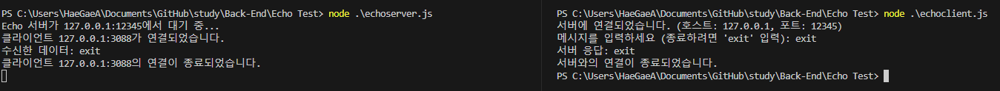

# Echo Test

### Echo Test

- 일반적으로 네트워크 연결 또는 통신을 테스트하기 위한 목적으로 사용
    - ex) 예를 들어, "Echo Server"는 클라이언트가 전송한 메시지를 다시 클라이언트로 보내는 서버 → 클라이언트가 서버에 메시지를 보내면 서버가 해당 메시지를 그대로 다시 보내고, 클라이언트는 이를 수신하여 통신이 정상적으로 작동하는지 확인할 수 있음
- Echo 테스트는 네트워크 문제 해결 및 디버깅에 유용

- 실습 결과



- 실습 코드

```jsx
//echoserver.js
const net = require("net");

// 서버 설정
const host = "127.0.0.1";  // 서버 IP 주소
const port = 12345;        // 서버 포트 번호

// 서버 생성
const server = net.createServer((client) => {
  console.log(`클라이언트 ${client.remoteAddress}:${client.remotePort}가 연결되었습니다.`);

  // 클라이언트로부터 데이터 수신
  client.on("data", (data) => {
    console.log(`수신한 데이터: ${data}`);
    
    // 수신한 데이터를 그대로 클라이언트에게 전송 (Echo)
    client.write(data);
  });

  // 클라이언트 연결 종료
  client.on("end", () => {
    console.log(`클라이언트 ${client.remoteAddress}:${client.remotePort}의 연결이 종료되었습니다.`);
  });
});

// 서버 시작
server.listen(port, host, () => {
  console.log(`Echo 서버가 ${host}:${port}에서 대기 중...`);
});
```

```jsx
// echoclient.js
const net = require("net");
const readline = require("readline");

// 서버 설정
const host = "127.0.0.1";  // 서버 IP 주소
const port = 12345;        // 서버 포트 번호

// 클라이언트 생성
const client = new net.Socket();

// 서버에 연결
client.connect(port, host, () => {
  console.log(`서버에 연결되었습니다. (호스트: ${host}, 포트: ${port})`);
  
  // 사용자 입력을 위한 인터페이스 생성
  const rl = readline.createInterface({
    input: process.stdin,
    output: process.stdout
  });

  // 사용자로부터 메시지 입력
  rl.question("메시지를 입력하세요 (종료하려면 'exit' 입력): ", (message) => {
    // 입력한 메시지를 서버로 전송
    client.write(message);

    // 'exit' 입력 시 클라이언트 종료
    if (message === "exit") {
      client.end();
    }
  });

  // 서버로부터 데이터 수신
  client.on("data", (data) => {
    console.log(`서버 응답: ${data}`);
  });

  // 서버 연결 종료
  client.on("close", () => {
    console.log("서버와의 연결이 종료되었습니다.");
    rl.close();
  });
});
```